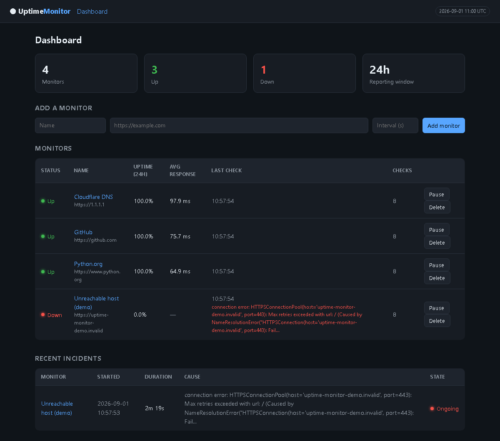
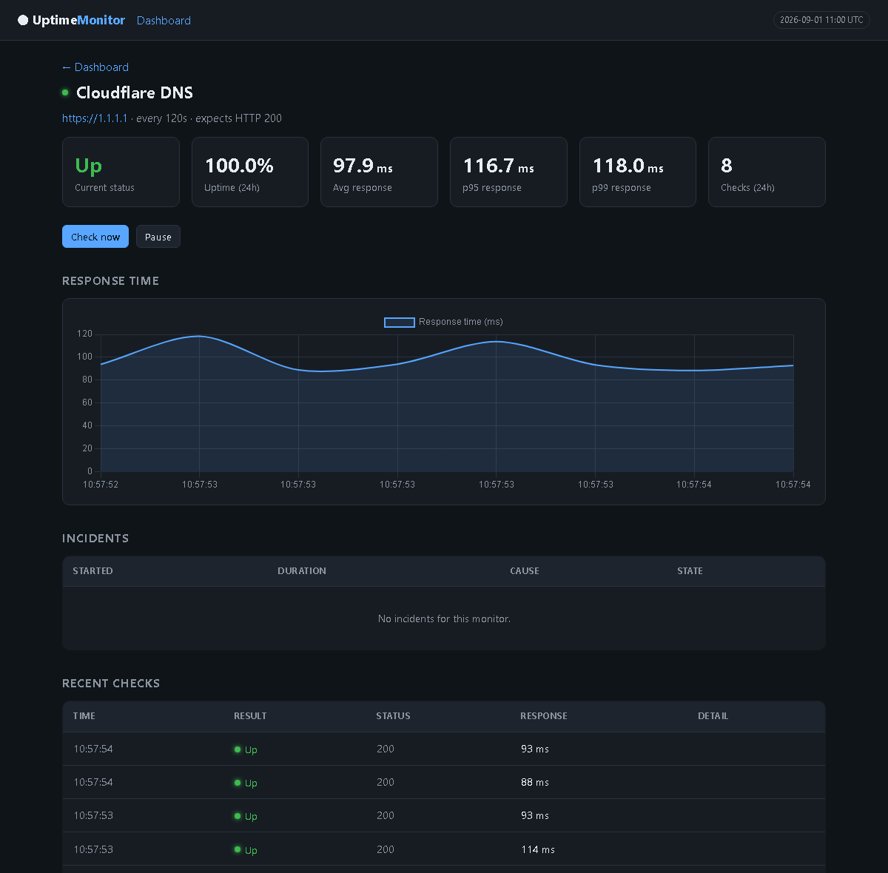

# Uptime Monitor

**A self-hosted uptime monitor that alerts like a real one** — it polls your
endpoints, tracks incidents rather than individual failures, and messages
Slack when something breaks or comes back.

[](https://github.com/chanllawala/uptime-monitor/actions/workflows/ci.yml)




**Per-monitor detail** — p50/p95/p99 latency alongside the average, a
response-time chart, and the incident history:



---

## What it does

- **Scheduled checks.** A worker process polls each monitor on its own
  interval, recording status code, response time, and any error.
- **Incident tracking.** Consecutive failures open an incident; a success
  closes it. The dashboard shows a timeline of outages with their durations.
- **Real Slack alerts.** One message when a service goes down, one when it
  recovers, with the downtime included.
- **Uptime reporting.** Uptime percentage, average and p50/p95/p99 response
  times over a rolling window, plus a response-time chart per monitor.
- **Prometheus metrics.** `/metrics` exposes per-monitor state, uptime ratio,
  latency percentiles, check counters and staleness, ready to scrape.
- **Concurrent polling.** Checks fan out across a thread pool, so one slow
  endpoint doesn't delay every monitor queued behind it.
- **Structured logging.** `LOG_FORMAT=json` emits one object per line with
  fields promoted to top level, for querying in a log aggregator.
- **Managed from the browser.** Add, pause, delete, and force an immediate
  re-check without touching the database.
- **Works on a phone.** Below 760px each table row restacks into a labelled
  card, so the dashboard is readable when an alert reaches you away from a
  desk — which is when you actually need it.

## Alerting behaviour

This is the part that makes it usable rather than annoying:

- **A single failed check does not alert.** A monitor must fail
  `FAILURE_THRESHOLD` times consecutively (default 3) before it is declared
  down, so a momentary blip stays quiet.
- **A service that stays down alerts once, not once per poll.** Alerts fire on
  state *transitions*, driven off incidents rather than individual checks.
- **A success resets the failure count**, so flapping does not accumulate
  toward the threshold.
- **Recovery is always announced**, with how long the outage lasted.

`tests/test_engine.py` covers each of these rules directly.

## Architecture

Three containers, so that a slow or hanging HTTP check can never block the
dashboard from rendering:

```
┌──────────┐        ┌──────────────┐
│  worker  │        │     web      │   FastAPI + Jinja2 dashboard
│ (poller) │        │  (dashboard) │   → :8000
└────┬─────┘        └──────┬───────┘
     │                     │
     └──────────┬──────────┘
                ▼
          ┌───────────┐
          │ postgres  │  monitors · checks · incidents
          └───────────┘
```

| Module | Responsibility |
| --- | --- |
| `app/checker.py` | Performs one HTTP check; classifies the outcome |
| `app/engine.py` | State machine: thresholds, incidents, when to alert; fans checks out across a thread pool |
| `app/scheduler.py` | Worker loop; finds due monitors, handles shutdown |
| `app/notifier.py` | Slack delivery, with a logging fallback |
| `app/stats.py` | Uptime, averages and latency percentiles |
| `app/metrics.py` | Prometheus exposition |
| `app/logging_setup.py` | Text or JSON log formatting |
| `app/web.py` | Dashboard routes and `/metrics` |

`engine.py` is deliberately separate from `scheduler.py` so the alerting logic
can be tested without any sleeping, threading, or real network calls.

## Running it

### With Docker (how it runs in production)

```bash
cp .env.example .env     # add your Slack webhook URL
docker compose up -d --build
docker compose exec web python -m app.seed    # optional starter monitors
```

Dashboard at <http://localhost:8000>.

```bash
docker compose logs -f worker    # watch checks happen live
```

### Without Docker

Falls back to SQLite, so no database server is needed:

```bash
python -m venv venv
./venv/Scripts/pip install -r requirements-dev.txt   # Windows
# source venv/bin/activate && pip install -r requirements-dev.txt

python -m app.seed
python -m app.scheduler                              # terminal 1
python -m uvicorn app.web:app --port 8000            # terminal 2
```

## Slack alerts

1. Create an Incoming Webhook at <https://api.slack.com/messaging/webhooks>.
2. Put it in `.env` as `SLACK_WEBHOOK_URL`.
3. Restart: `docker compose restart worker`.

Without a webhook the app runs normally and logs alerts instead of sending
them, which is how the tests and local development work. A failed delivery is
logged and swallowed — a broken webhook must never take the poller down with
it, and the failure is logged without the URL so the secret stays out of the
logs.

## Metrics

`GET /metrics` returns Prometheus exposition format:

```
uptime_monitor_up{monitor="GitHub",url="https://github.com"} 1
uptime_monitor_uptime_ratio{monitor="GitHub",url="https://github.com"} 1
uptime_monitor_response_time_p95_milliseconds{monitor="GitHub",...} 74.9
uptime_monitor_last_check_age_seconds{monitor="GitHub",...} 41.2
uptime_checks_total{monitor="GitHub",...,result="up"} 5
```

Scrape it with:

```yaml
scrape_configs:
  - job_name: uptime-monitor
    static_configs:
      - targets: ["localhost:8000"]
```

Two decisions worth noting:

- **Metrics are derived from the database on each scrape, not held as
  in-process counters.** The worker and the dashboard are separate containers,
  so a counter incremented in the worker would be invisible to the process
  serving `/metrics`. The database is the only state they share.
- **A monitor that has never been checked is omitted from `uptime_monitor_up`
  rather than reported as `0`.** Unknown is not the same as down, and
  reporting it as down would page someone over a monitor added seconds ago.

`uptime_monitor_last_check_age_seconds` is the one to alert on for the
monitoring system itself — if it climbs past the poll interval, the worker has
stalled and every other metric here has quietly gone stale.

## Configuration

| Variable | Default | Meaning |
| --- | --- | --- |
| `DATABASE_URL` | `sqlite:///./uptime.db` | Postgres URL in Docker |
| `SLACK_WEBHOOK_URL` | *(empty)* | Blank disables sending |
| `FAILURE_THRESHOLD` | `3` | Consecutive failures before alerting |
| `SCHEDULER_TICK_SECONDS` | `5` | How often the worker looks for due monitors |
| `DEFAULT_INTERVAL_SECONDS` | `60` | Default poll interval for new monitors |
| `DEFAULT_TIMEOUT_SECONDS` | `10` | Request timeout per check |
| `CHECK_CONCURRENCY` | `8` | Checks polled in parallel per tick |
| `LOG_FORMAT` | `text` | `json` for structured logs |
| `LOG_LEVEL` | `INFO` | Standard Python log levels |
| `METRICS_WINDOW_HOURS` | `24` | Rolling window for `/metrics` and percentiles |
| `RUN_SCHEDULER_IN_WEB` | `false` | Run the poller inside the web process, for hosts with no worker type |

## Tests

```bash
pytest -v
ruff check . && ruff format --check .
```

55 tests covering HTTP classification (including timeouts and DNS failures),
the incident state machine, uptime maths and percentiles, Prometheus
exposition, structured logging, and concurrent checking. Two worth
singling out:

- one asserts a failed Slack delivery never writes the webhook URL into the
  logs, since request exceptions embed the full URL
- one asserts checks genuinely overlap, by timing six deliberately slow
  endpoints and requiring the total to come in well under their serial sum

## CI/CD

`.github/workflows/ci.yml` runs on every push and pull request:

1. **Lint and test** — `ruff check`, `ruff format --check`, `pytest`
2. **Build image** — builds the container, starts it, and polls `/health`
   until it answers, so a broken image fails CI rather than production
3. **Deploy** — SSHes to the VM and runs `docker compose up -d --build`

The deploy job only runs on `master`, never on pull requests, and is gated on
a `DEPLOY_ENABLED` repository variable so the workflow stays green before any
VM exists.

## Deployment

### Render (simplest)

[`render.yaml`](render.yaml) provisions a single free web service and nothing
else — no VM, no SSH, no firewall rules, no database resource. In the Render
dashboard: **New → Blueprint**, point it at this repo, **Apply**.

It deliberately asks for no Postgres, because Render allows only one free
database per account and a blueprint requesting a second one fails outright.
With `DATABASE_URL` unset the app falls back to SQLite. To keep history across
restarts, set `DATABASE_URL` to any Postgres connection string in the
service's Environment tab; nothing else changes. `SLACK_WEBHOOK_URL` goes in
the same place.

Two free-tier caveats worth knowing before showing anyone:

- Free services sleep after ~15 minutes idle, so polling pauses while nobody
  is looking and resumes when the dashboard is next opened.
- The free filesystem is ephemeral, so SQLite history resets when the service
  restarts. The app re-seeds on boot, so it returns with monitors ready rather
  than empty.

Fine for a demo; not what you would run for real.

### Docker on a VM (polls continuously)

See [`deploy/oracle-cloud.md`](deploy/oracle-cloud.md) for provisioning an
Oracle Cloud Always Free VM, opening both firewall layers, installing Docker,
and wiring up the GitHub Actions deploy secrets. This runs the worker as its
own process and never sleeps.

## Notes and limitations

- Checks fan out across a thread pool, which is fine into the hundreds.
  Thousands would want an async client rather than a thread per request.
- `/metrics` runs a handful of queries per monitor per scrape. At a few dozen
  monitors that is negligible; at a few thousand it would need caching or a
  single aggregate query.
- There is no authentication on the dashboard or `/metrics`. It is intended to sit behind a
  reverse proxy or on a private network — see the Caddy section of the deploy
  guide.
- Check history grows without bound. A production deployment would want a
  retention policy or downsampling of older data.
